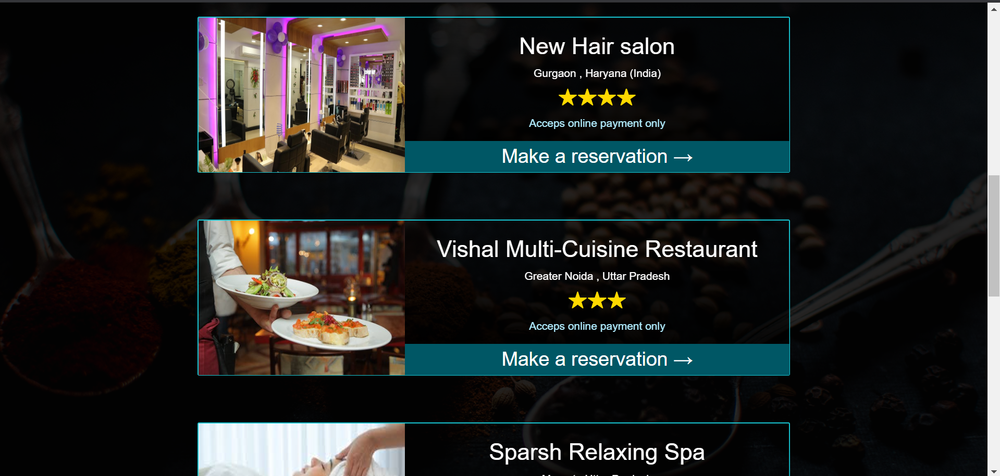

## Aatm Nirbhar (Connect to outside world)

It's a platform where the facility providers(restaurant , Salon , Malls , Shops) can register their services and customer can enjoy these facilities by registering themselves to the particular firm.  
Implemented using HTML , SASS , and Firebase as database. 
[Link to the deployed App](https://aatm-nirbhar-connect-to-outside-world-git-master.deeksha2501.now.sh/)  

- Authentication is made for Facility Providers
- Facility provider can update their credentials , delete their facility and can upload image of their firm too.
- Customer can register to any firm and they just need to fill some required information(Name , mailID , Contact Number , Address)
- Facility providers can see all the customers who are registered to their firm and can remove any customer too.
- Search Functionality is also provided

## Screenshots of the Project

 

- [x] Facility Provider Dashboard
- [x] Facility Authentication
- [x] Deployment
- [ ] Customer Dashboard
- [ ] Customer Authentication
- [ ] Improve search Functionality
